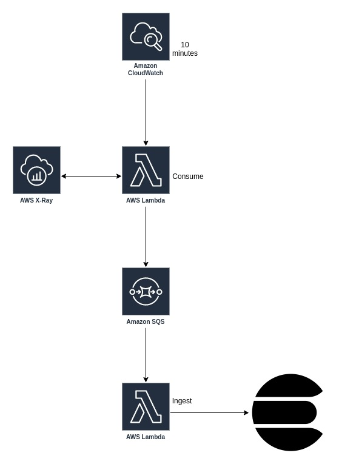

# xray2elasticsearch

## A Boilerplate to ingest xray traces into Elasticsearch in AWS

### Requirements

In order to execute deployment for this project, some tools and frameworks are necessary:

- [python](https://www.python.org/) 3.7+ installed
- [pipenv](https://pypi.org/project/pipenv/)
- [Serverless framework](https://serverless.com/)
- [make](https://www.gnu.org/software/make/) (CMake, GNU Make or BSD Make)
- [awscli](https://docs.aws.amazon.com/cli/latest/userguide/cli-chap-install.html)

You can procede to deployment if you already have these tools

## What is xray?

AWS Xray is a resource provided by AWS that can be used to monitor the executions of your applications: More information here [XRAY](https://docs.aws.amazon.com/xray/latest/devguide/aws-xray.html)

### xray2elasticsearch architecture



## Deploy

```bash
make DEPLOYMENT_BUCKET="" ES_HOST="" ES_INDEX="" SQS_QUEUE_NAME="" deploy
```

- Required variables:

  - ES_HOST: The endpoint of elasticsearch
  - DEPLOYMENT_BUCKET: The aws bucket where the code will be stored

- OPTIONAL
  - ES_INDEX: THE NAME OF INDEX (OPTIONAL: IF NOT PROVIDED WILL BE xray-yyyy-mm-dd), the date part is default by the application
  - SQS_QUEUE_NAME: The name of SQS Queue, DEFAULT=xray-to-elasticsearch-delivery
    You can edit the Makefile variable SQS_QUEUE_NAME for other one of your choice!
